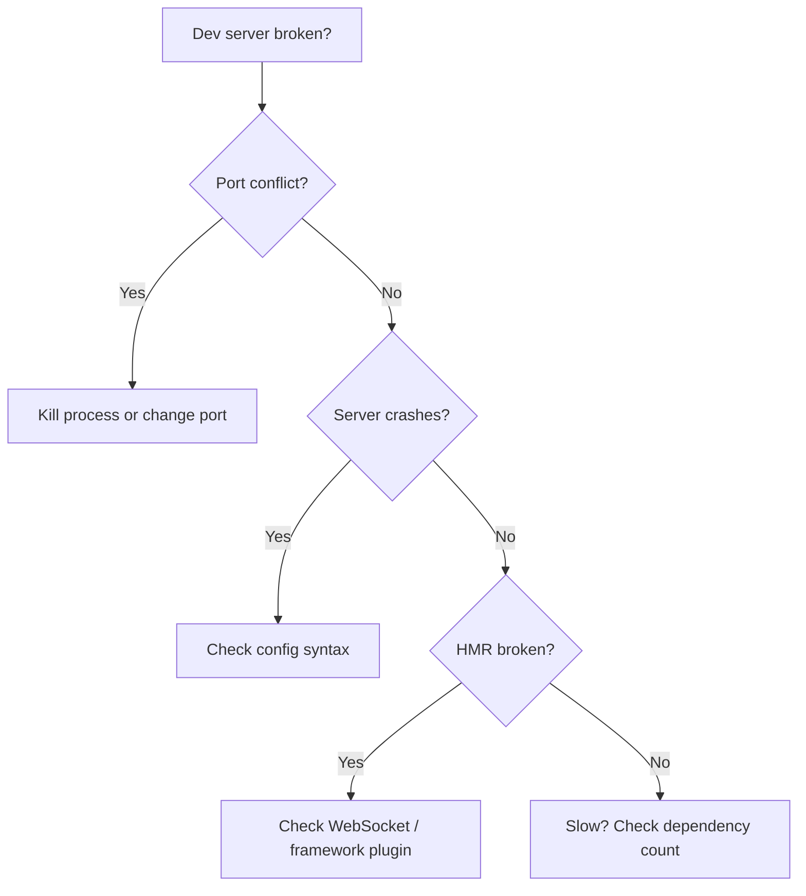
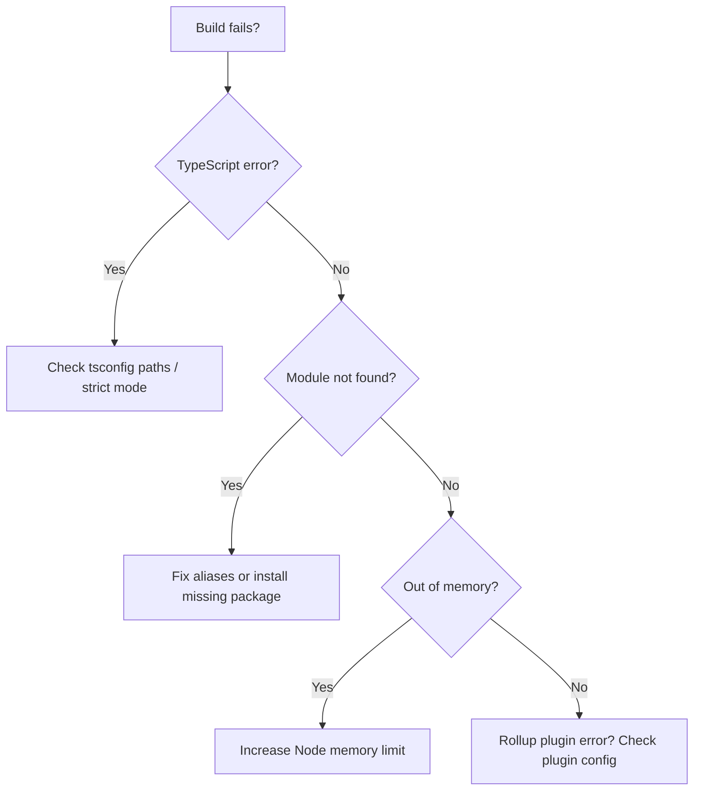
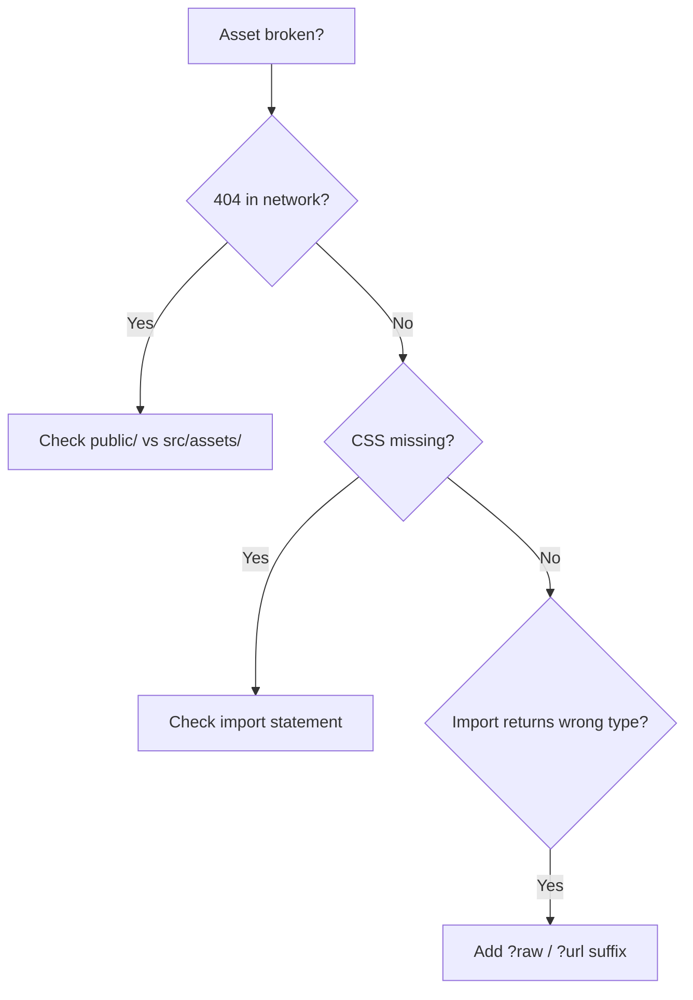
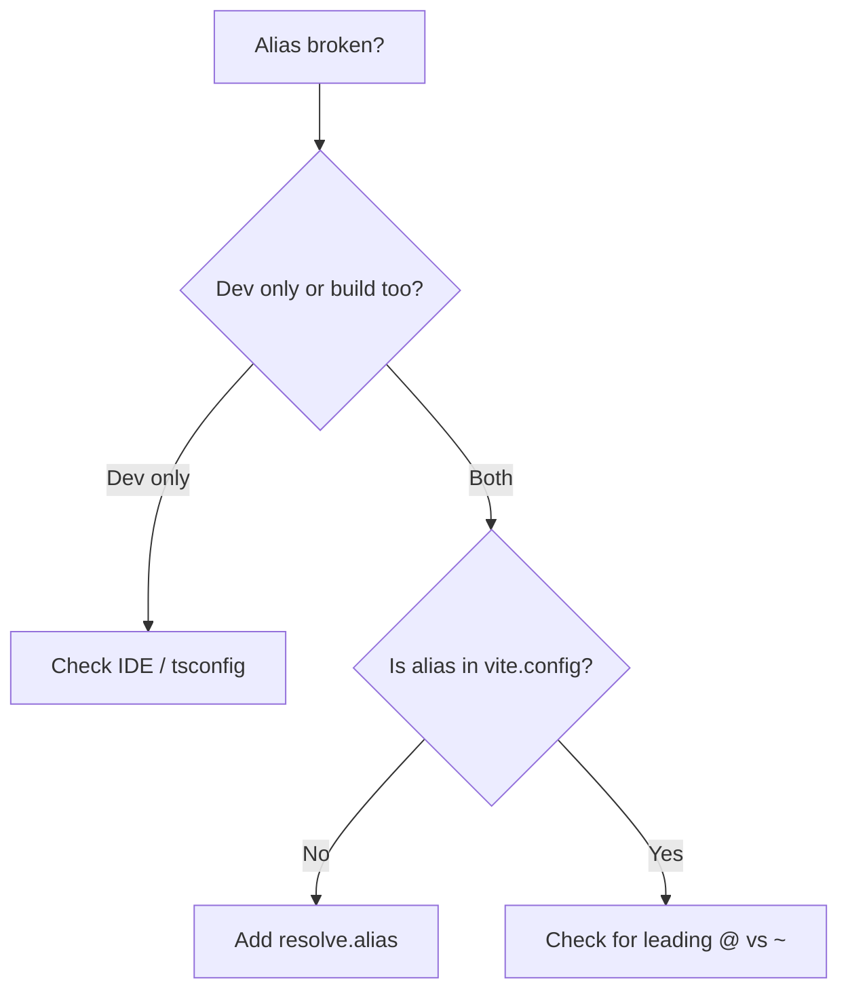
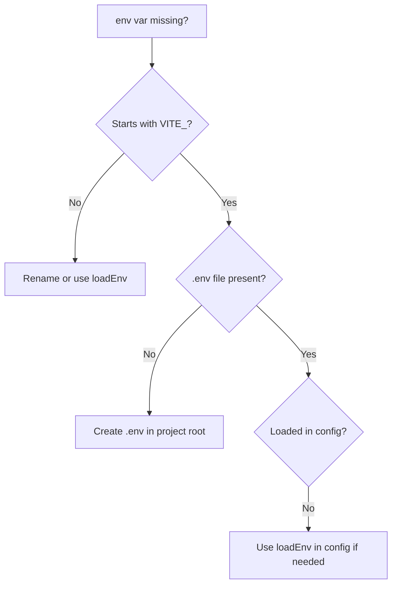
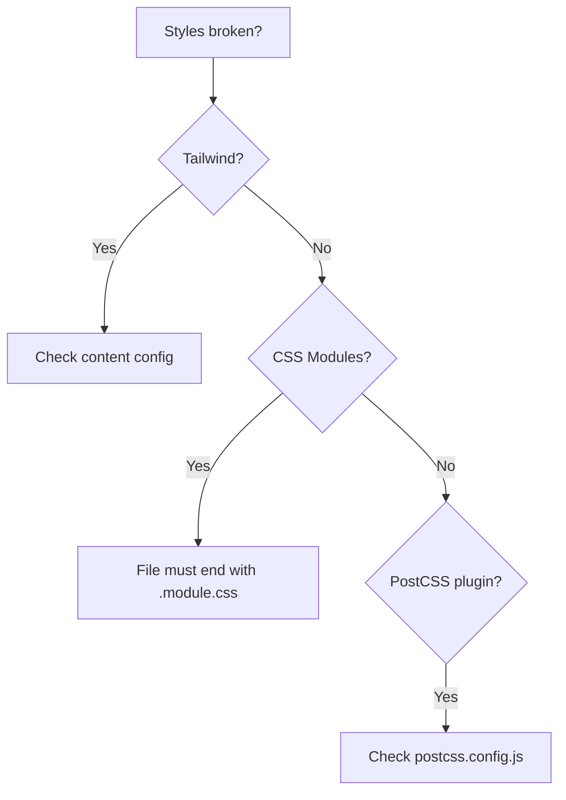
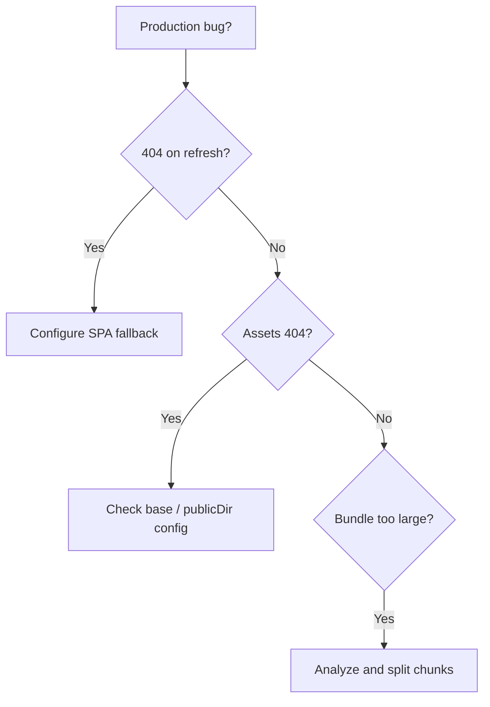
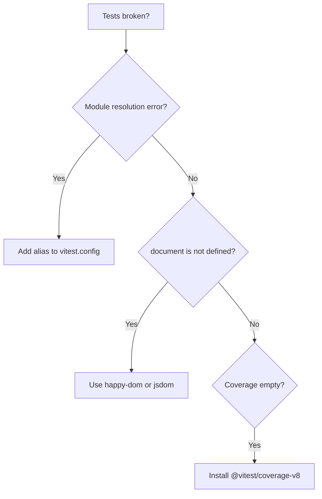
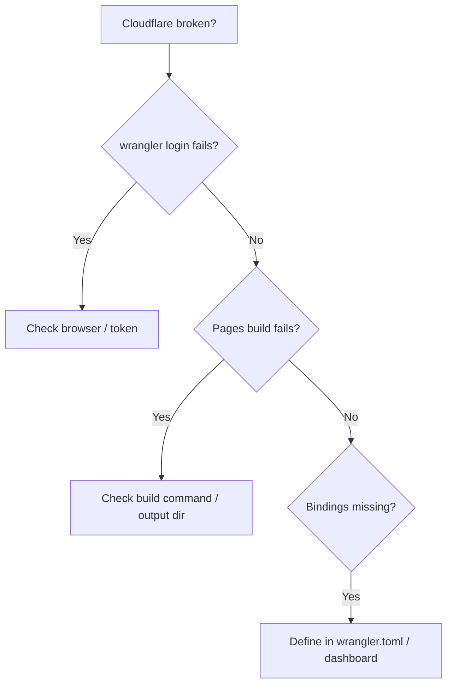

# 🚨 Vite Troubleshooting Guide

**Problem-first reference.** Find your error message, copy the fix, verify it works.

**How to use:**
1. Locate the section matching your symptom (dev server, build, assets, etc.)
2. Find the exact error message or closest description
3. Apply the fix — code blocks are copy-paste ready
4. Run `npm run dev` or `npm run build` to verify

---

## Development Server Issues



### Error: `Error: Port 5173 is already in use`

**Symptoms:** `npm run dev` fails immediately with port conflict.

**Cause:** Another Vite process or app is bound to the default port.

**Fix:**
```bash
# Option 1: Kill the existing process
npx kill-port 5173

# Option 2: Use a different port
npm run dev -- --port 3000

# Option 3: Configure in vite.config.ts
export default defineConfig({
  server: { port: 3000 }
})
```

**Verify:** `npm run dev` starts without port errors.

---

### Error: Dev server exits immediately / `Cannot find module 'vite'`

**Symptoms:** `npm run dev` throws module resolution error before starting.

**Cause:** `node_modules` is corrupted, incomplete, or Vite is not installed.

**Fix:**
```bash
rm -rf node_modules package-lock.json
npm install
```

**Verify:** `npx vite --version` prints a version number.

---

### Error: HMR not working — page reloads on every change

**Symptoms:** Saving a file triggers a full browser reload instead of hot update.

**Cause:** The framework plugin (React, Vue) is missing or misconfigured.

**Fix:**
```typescript
// vite.config.ts
import { defineConfig } from 'vite'
import react from '@vitejs/plugin-react'

export default defineConfig({
  plugins: [react()], // MUST include framework plugin
})
```

**Verify:** Edit a component — only that component updates without page refresh.

---

### Error: HMR extremely slow (>2s per change)

**Symptoms:** Every save takes seconds to reflect in the browser.

**Cause:** Too many unoptimized dependencies or the project is inside a slow filesystem (Docker volume, network drive).

**Fix:**
```typescript
// vite.config.ts
export default defineConfig({
  optimizeDeps: {
    include: ['lodash', 'moment'], // Pre-bundle heavy deps
  },
})
```

**Verify:** Check DevTools Network tab — module requests should return from cache after first load.

---

### Error: `WebSocket connection to 'ws://localhost:5173' failed`

**Symptoms:** HMR silently fails; console shows WebSocket errors.

**Cause:** A proxy, firewall, or browser extension is blocking the WebSocket.

**Fix:**
```bash
# Disable browser extensions (especially privacy/ad blockers)
# Or configure the HMR WebSocket host
npm run dev -- --host 127.0.0.1
```

```typescript
// vite.config.ts
export default defineConfig({
  server: {
    hmr: {
      host: 'localhost',
      protocol: 'ws',
    }
  }
})
```

**Verify:** Console shows `vite:hmr` WebSocket connected without errors.

---

## Build Errors



### Error: `error TS2322: Type 'X' is not assignable to type 'Y'`

**Symptoms:** `npm run build` fails with TypeScript type errors.

**Cause:** Vite does not type-check during dev; errors surface only at build time if `tsc` runs.

**Fix:**
```bash
# Check types before building
npx tsc --noEmit

# Or allow JS during build (not recommended for prod)
// vite.config.ts
export default defineConfig({
  esbuild: {
    tsconfigRaw: {
      compilerOptions: { allowJs: true }
    }
  }
})
```

**Verify:** `npx tsc --noEmit` exits with code 0.

---

### Error: `Cannot find module '@components/Button'`

**Symptoms:** Build fails with module resolution error for aliased paths.

**Cause:** Path alias is defined in `vite.config.ts` but Rollup does not know about it.

**Fix:**
```typescript
// vite.config.ts
import { defineConfig } from 'vite'
import path from 'path'

export default defineConfig({
  resolve: {
    alias: {
      '@components': path.resolve(__dirname, './src/components'),
    },
  },
})
```

**Verify:** `npm run build` completes without module errors.

---

### Error: Build hangs indefinitely or `JavaScript heap out of memory`

**Symptoms:** `npm run build` freezes or crashes with memory error.

**Cause:** Circular dependencies, massive bundle, or insufficient Node.js heap.

**Fix:**
```bash
# Increase Node.js memory limit
export NODE_OPTIONS="--max-old-space-size=4096"
npm run build

# Or find circular deps
npx madge --circular src/
```

**Verify:** Build completes within a reasonable time.

---

### Error: `RollupError: Unexpected token` in a dependency

**Symptoms:** Build fails when processing a `node_modules` package.

**Cause:** A dependency ships ESM with syntax (e.g., `??=`) that esbuild does not handle.

**Fix:**
```typescript
// vite.config.ts
export default defineConfig({
  build: {
    commonjsOptions: {
      transformMixedEsModules: true,
    },
  },
  esbuild: {
    target: 'es2020', // Lower if needed
  },
})
```

**Verify:** Build succeeds; check output in `dist/`.

---

### Error: `Could not resolve './foo.css'` from virtual module

**Symptoms:** Build fails on CSS import inside a virtual or generated module.

**Cause:** Vite's CSS handling in virtual modules requires explicit IDs.

**Fix:**
```typescript
// Ensure the CSS import uses a resolvable path
import './styles/foo.css'

// If generated dynamically, emit the CSS via a plugin:
// https://vitejs.dev/guide/api-plugin.html#virtual-modules-convention
```

**Verify:** Build output contains the expected CSS.

---

## Asset & Import Issues



### Error: Image returns 404 in development

**Symptoms:** `` does not render; DevTools shows 404.

**Cause:** File is in `src/assets/` but referenced with a root-relative path, or it's in `public/` but referenced incorrectly.

**Fix:**
```tsx
// File in src/assets/ — import it
import logo from './assets/logo.png'


// File in public/ — use root-relative path

```

**Verify:** Image loads in browser without 404.

---

### Error: SVG imported as string instead of React component

**Symptoms:** `import Logo from './logo.svg'` renders `[object Object]` or string URL.

**Cause:** Default Vite imports SVGs as URLs; React component import requires `vite-plugin-svgr`.

**Fix:**
```bash
npm install vite-plugin-svgr
```

```typescript
// vite.config.ts
import svgr from 'vite-plugin-svgr'

export default defineConfig({
  plugins: [svgr()],
})
```

```tsx
// In component
import { ReactComponent as Logo } from './logo.svg'
```

**Verify:** SVG renders as a React component.

---

### Error: CSS styles not applied to component

**Symptoms:** Component renders without expected styles.

**Cause:** CSS is not imported, or CSS Modules are used without the `.module.css` extension.

**Fix:**
```tsx
// Global CSS
import './styles.css'

// CSS Modules
import styles from './Button.module.css'
<button className={styles.primary}>
```

**Verify:** DevTools Elements panel shows the expected classes.

---

### Error: `import json from './data.json'` returns `{ default: {} }`

**Symptoms:** JSON import is wrapped in a default export unexpectedly.

**Cause:** Vite 5+ changed JSON import behavior to align with ESM standards.

**Fix:**
```typescript
// vite.config.ts
export default defineConfig({
  json: {
    stringify: false, // Default since Vite 5
  },
})
```

```tsx
// Use named import
import { name } from './data.json'
```

**Verify:** `console.log(name)` prints the expected value.

---

### Error: `?raw` import returns URL instead of string content

**Symptoms:** `import shader from './shader.glsl?raw'` is not a string.

**Cause:** The `?raw` suffix must be explicit; default import behavior returns a URL.

**Fix:**
```typescript
// Correct
import shader from './shader.glsl?raw'

// Incorrect (returns URL)
import shader from './shader.glsl'
```

**Verify:** `typeof shader === 'string'` is true.

---

## Path Alias Issues



### Error: `Cannot find module '@components/Button' or its corresponding type declarations.`

**Symptoms:** TypeScript underlines the import; build also fails.

**Cause:** `tsconfig.json` does not map the alias to a filesystem path.

**Fix:**
```json
// tsconfig.json
{
  "compilerOptions": {
    "baseUrl": ".",
    "paths": {
      "@components/*": ["src/components/*"],
      "@/*": ["src/*"]
    }
  }
}
```

**Verify:** VS Code / TypeScript no longer shows red squiggles.

---

### Error: Alias works in dev but fails in production build

**Symptoms:** `npm run dev` works; `npm run build` throws module not found.

**Cause:** Alias is defined in `tsconfig.json` but missing in `vite.config.ts`.

**Fix:**
```typescript
// vite.config.ts
import { defineConfig } from 'vite'
import path from 'path'

export default defineConfig({
  resolve: {
    alias: {
      '@': path.resolve(__dirname, './src'),
      '@components': path.resolve(__dirname, './src/components'),
    },
  },
})
```

**Verify:** `npm run build` completes successfully.

---

### Error: `Relative imports outside of src/ are not allowed`

**Symptoms:** Cannot import from `../shared` or outside the project root.

**Cause:** Vite restricts imports outside the project root for security.

**Fix:**
```typescript
// vite.config.ts
export default defineConfig({
  server: {
    fs: {
      allow: ['..', '/some/absolute/path'],
    },
  },
})
```

**Verify:** Import resolves without server error.

---

## Environment Variables



### Error: `import.meta.env.VITE_API_URL` is `undefined`

**Symptoms:** Environment variable is not accessible in code.

**Cause:** Variables without the `VITE_` prefix are not exposed to the client.

**Fix:**
```bash
# .env (must be in project root)
VITE_API_URL=https://api.example.com
```

```typescript
// In code
const apiUrl = import.meta.env.VITE_API_URL
```

**Verify:** `console.log(import.meta.env.VITE_API_URL)` prints the value.

---

### Error: `import.meta.env` does not include custom variables

**Symptoms:** Variables defined in `.env.local` or `.env.production` are missing.

**Cause:** Only `.env` and `.env.[mode]` are loaded automatically; custom files need explicit loading.

**Fix:**
```bash
# Use the correct mode
npm run build -- --mode staging
```

```typescript
// vite.config.ts
import { defineConfig, loadEnv } from 'vite'

export default defineConfig(({ mode }) => {
  const env = loadEnv(mode, process.cwd(), '')
  return {
    define: {
      __API_KEY__: JSON.stringify(env.API_KEY),
    },
  }
})
```

**Verify:** `console.log(__API_KEY__)` prints the value.

---

### Error: `.env` file changes not reflected in dev server

**Symptoms:** Edited `.env` but `import.meta.env` still shows old values.

**Cause:** Vite loads `.env` once at server start; changes require a restart.

**Fix:**
```bash
# Restart the dev server
Ctrl+C
npm run dev
```

**Verify:** New values appear in `import.meta.env`.

---

## Styling Issues



### Error: Tailwind CSS classes have no effect

**Symptoms:** Utility classes like `bg-blue-500` render without styles.

**Cause:** Tailwind's `content` array does not scan your source files.

**Fix:**
```javascript
// tailwind.config.js
module.exports = {
  content: [
    './index.html',
    './src/**/*.{js,ts,jsx,tsx}',
  ],
  theme: { extend: {} },
  plugins: [],
}
```

```css
/* src/index.css */
@tailwind base;
@tailwind components;
@tailwind utilities;
```

**Verify:** `bg-blue-500` applies a blue background.

---

### Error: CSS Modules class names are not scoped

**Symptoms:** Styles leak globally; `styles.button` is undefined.

**Cause:** File is named `.css` instead of `.module.css`.

**Fix:**
```tsx
// Rename file
// Button.css → Button.module.css

import styles from './Button.module.css'
<button className={styles.primary} />
```

**Verify:** DevTools shows hashed class names like `Button_primary__xyz`.

---

### Error: PostCSS plugin (autoprefixer, nesting) not applied

**Symptoms:** CSS output is missing vendor prefixes or nested rules are broken.

**Cause:** No `postcss.config.js` exists, or Vite is not picking it up.

**Fix:**
```javascript
// postcss.config.js
module.exports = {
  plugins: {
    'tailwindcss/nesting': {},
    tailwindcss: {},
    autoprefixer: {},
  },
}
```

**Verify:** Inspect built CSS in `dist/assets/*.css` for prefixes.

---

### Error: Dark mode toggle does not change styles

**Symptoms:** `dark:` Tailwind classes are ignored.

**Cause:** Tailwind is configured for `media` strategy but you are toggling a class.

**Fix:**
```javascript
// tailwind.config.js
module.exports = {
  darkMode: 'class', // Use 'class' strategy
  // ...
}
```

```tsx
// Toggle dark mode
<html className={isDark ? 'dark' : ''}>
```

**Verify:** Adding `dark` class to `<html>` activates dark styles.

---

## Production Issues



### Error: `404 Not Found` when refreshing a route in production

**Symptoms:** `/about` works on navigation but fails on direct access or refresh.

**Cause:** Server does not serve `index.html` for unknown routes (SPA fallback).

**Fix:**
```nginx
# Nginx
location / {
  try_files $uri $uri/ /index.html;
}
```

```javascript
// Vercel — vercel.json
{
  "rewrites": [{ "source": "/(.*)", "destination": "/index.html" }]
}
```

```toml
# Netlify — netlify.toml
[[redirects]]
  from = "/*"
  to = "/index.html"
  status = 200
```

**Verify:** Directly visiting `/about` renders the app.

---

### Error: Assets return 404 after deployment

**Symptoms:** Images or JS chunks fail to load in production.

**Cause:** `base` path is misconfigured for the deployment environment.

**Fix:**
```typescript
// vite.config.ts
export default defineConfig({
  base: '/my-app/', // Must match your deployment path
})
```

**Verify:** Browser Network tab shows assets loading from `/my-app/assets/...`.

---

### Error: `dist/` output is unreasonably large

**Symptoms:** Bundle size exceeds several megabytes.

**Cause:** Dependencies are bundled into a single chunk.

**Fix:**
```typescript
// vite.config.ts
export default defineConfig({
  build: {
    rollupOptions: {
      output: {
        manualChunks: {
          vendor: ['react', 'react-dom'],
          ui: ['@radix-ui/react-dialog', '@radix-ui/react-tooltip'],
        },
      },
    },
  },
})
```

**Verify:** Run `npm run build` and check `dist/assets/` chunk sizes.

---

### Error: No source maps in production build

**Symptoms:** DevTools shows minified code; debugging is impossible.

**Cause:** Source maps are disabled by default in production or explicitly turned off.

**Fix:**
```typescript
// vite.config.ts
export default defineConfig({
  build: {
    sourcemap: true,
  },
})
```

**Verify:** `dist/assets/` contains `.js.map` files.

---

## Testing Issues



### Error: Vitest `Cannot find module '@components/Button'`

**Symptoms:** Tests fail with the same alias error as the build.

**Cause:** Vitest does not read `vite.config.ts` aliases unless configured to.

**Fix:**
```typescript
// vitest.config.ts
import { defineConfig } from 'vitest/config'
import path from 'path'

export default defineConfig({
  test: {},
  resolve: {
    alias: {
      '@': path.resolve(__dirname, './src'),
    },
  },
})
```

**Verify:** `npx vitest` runs without module errors.

---

### Error: `ReferenceError: document is not defined`

**Symptoms:** Tests crash when rendering React/Vue components.

**Cause:** Vitest runs in Node.js by default; DOM APIs are missing.

**Fix:**
```bash
npm install -D happy-dom
```

```typescript
// vitest.config.ts
export default defineConfig({
  test: {
    environment: 'happy-dom',
  },
})
```

**Verify:** Tests with `render()` from Testing Library pass.

---

### Error: Coverage report is empty or 0%

**Symptoms:** Running `vitest --coverage` produces no coverage data.

**Cause:** Coverage provider is not installed or configured.

**Fix:**
```bash
npm install -D @vitest/coverage-v8
```

```typescript
// vitest.config.ts
export default defineConfig({
  test: {
    coverage: {
      provider: 'v8',
      reporter: ['text', 'html'],
    },
  },
})
```

**Verify:** `npx vitest --coverage` prints coverage percentages.

---

### Error: `vi.mock` does not replace the module

**Symptoms:** Mocked module still executes real code during tests.

**Cause:** `vi.mock` must be called at the top level, before imports.

**Fix:**
```typescript
import { vi, test, expect } from 'vitest'

// Correct: mock BEFORE importing the subject
vi.mock('./api', () => ({
  fetchUser: vi.fn(() => Promise.resolve({ name: 'Mock' })),
}))

import { fetchUser } from './api'

test('mock works', async () => {
  const user = await fetchUser()
  expect(user.name).toBe('Mock')
})
```

**Verify:** The mocked function is called instead of the real implementation.

---

## Cloudflare Deployment Issues



### Error: `wrangler login` fails or hangs

**Symptoms:** Cannot authenticate Wrangler CLI.

**Cause:** Browser session expired or Wrangler cannot open the default browser.

**Fix:**
```bash
# Re-authenticate
npx wrangler logout
npx wrangler login

# Or use API token
npx wrangler config
```

**Verify:** `npx wrangler whoami` shows your account email.

---

### Error: Cloudflare Pages build fails with `Build command exited with error`

**Symptoms:** Pages CI build fails while local `npm run build` works.

**Cause:** Pages uses a different Node.js version or build environment.

**Fix:**
```json
// package.json
{
  "engines": {
    "node": ">=18.0.0"
  }
}
```

```toml
# wrangler.toml
[build]
command = "npm run build"
```

**Verify:** Pages build log shows successful completion.

---

### Error: Cloudflare Function returns `500` or never executes

**Symptoms:** API routes in `functions/` do not respond.

**Cause:** Function file structure or export signature is incorrect.

**Fix:**
```typescript
// functions/api/hello.ts
export interface Env {
  MY_KV: KVNamespace
}

export const onRequest: PagesFunction<Env> = async (context) => {
  const value = await context.env.MY_KV.get('key')
  return new Response(JSON.stringify({ value }), {
    headers: { 'Content-Type': 'application/json' },
  })
}
```

**Verify:** `curl https://your-site.pages.dev/api/hello` returns JSON.

---

### Error: `KVNamespace` or `D1Database` binding not found in function

**Symptoms:** Runtime error: `context.env.MY_KV is undefined`.

**Cause:** Binding is declared in code but not configured in Wrangler.

**Fix:**
```toml
# wrangler.toml
[[kv_namespaces]]
binding = "MY_KV"
id = "your-kv-namespace-id"

[[d1_databases]]
binding = "DB"
database_name = "my-db"
database_id = "your-db-id"
```

**Verify:** `npx wrangler pages dev --binding MY_KV=test` loads the binding.

---

## Quick Reference

| Command | Purpose |
|---------|---------|
| `npx kill-port 5173` | Free the default Vite port |
| `npm run dev -- --host` | Expose dev server to network |
| `npx tsc --noEmit` | Type-check without emitting |
| `npx vitest --coverage` | Run tests with coverage |
| `npm run build -- --mode staging` | Build for a specific mode |
| `npx vite --debug` | Start dev server with debug logs |

---

**Last updated:** Vite 5.x / Vitest 1.x / Wrangler 3.x
